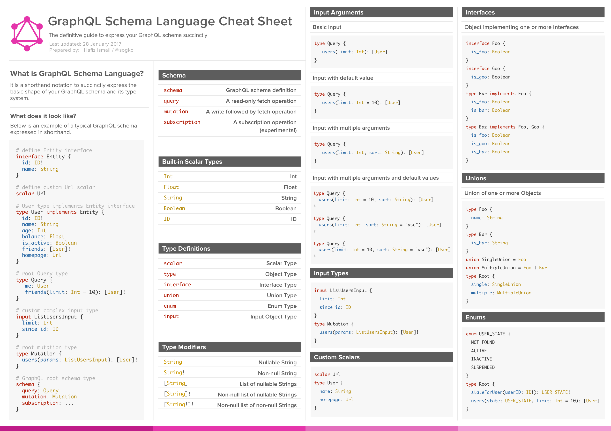

# Graphql basics & small demo
<h3>GraphQL—a query language for APIs that was originally built by Facebook—makes it easier for you to get the data you actually need from a query</h3>

### Why Graphql

RESTful APIs follow clear and well-structured resource-oriented approach. However, when the data gets more complex, the routes get longer. Sometimes it is not possible to fetch data with a single request. This is where GraphQL comes handy. GraphQL structures data in the form of a graph with its powerful query syntax for traversing, retrieving, and modifying data.

The following are advantages of using GraphQL query Language −

Ask for what you want − and get it
Send a GraphQL query to your API and get exactly what you need. GraphQL queries always return predictable results. Applications using GraphQL are fast and stable. Unlike Restful services, these applications can restrict data that should be fetched from the server

### Technologies used in demo
    *   ***Express - Express.js is a Node.js web application server framework, designed for building single-page, multi-page, and hybrid web applications
    *   <b>GraphQL</b> - GraphQL is a query language for APIs and a runtime for fulfilling those queries with your existing data.
    *   <b>casual</b> - Fake data generator for javascript
    *   <b>graphql-tools -generate and mock GraphQL.js schemas.
    *   <b>lodash</b> -Lodash is a JavaScript library which provides utility functions for common programming tasks using the functional programming paradigm
    *   <b>mongoose</b> - Mongoose is an Object Data Modeling (ODM) library for MongoDB and Node.js.
    *   <b>nodemon</b> - nodemon is a tool that helps develop node.js based applications by automatically restarting the node application when file changes in the directory
    *   <b>sequelize</b> - Sequelize is a promise-based Node.js ORM for Postgres, MySQL, SQLite and Microsoft SQL Server. 
    *   <b>sqlite3</b> - SQLite3 is a compact free database you can use easily create and use a database.  

### Query
        query{
            getAliens{
                firstName
                id
            }
        }
### Mutation
* createFriend

        mutation{
            createFriend(input:{
            firstName:"bhanu"
            lastName:"karkra"
            gender:MALE
            language:"english"
            email:"bhanu@gmail.com"
            contacts:[{
                firstName:"B"
                lastName:"k"
            }]
        }) {
            id
            firstName
            language
            contacts{
            firstName
            lastName
            }
        }
    }
    * updateFriend

            mutation{
                updateFriend(input:{
                    id:"5c02329f9641e2b73d0a62ef"
                    firstName:"nixalar",
                    age:34
                }){
                firstName
                age
                }
            }

### Fragment

        query{
            one:getOneFriend(id:"8678686876876jgh986"){
                ...friendFragment
            }
            second:getOneFriend(id:"8678686876876jgh986"){
                ...friendFragment
            }
        }

        fragment friendFragment on Friend{
            firstName
            lastName
            gender
            age
        }

### Cheat sheet

### Thanks.
*   Lynda - GraphQL Essential Training
*   Google 
*   Tutorial point